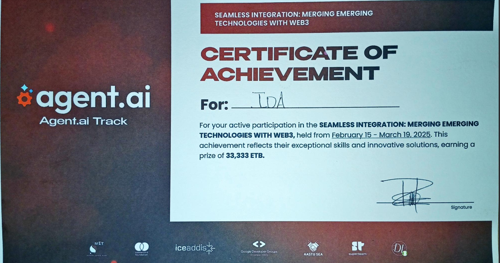

### **IDA**  
🚀 *Revolutionizing healthcare accessibility using AI agents to provide people with medicine information and pharmacy discovery.*  

---

## 🏆 **Hackathon Winner!**
We are thrilled to announce that **IDA** has won the hackathon!  Our innovative AI-powered medical assistant stood out for its **impactful healthcare solution, seamless user experience, and blockchain integration.** Thank you to everyone who supported us on this journey! 🙌  



---

## **🌟 Overview**  
The **AI-Powered Medical Assistant** is an **interactive, modern, and intuitive** web application that enhances **healthcare accessibility**. Leveraging **Agent.AI**, we empower individuals with accurate medical information and help them locate pharmacies efficiently. Our AI agent acts as a virtual assistant, bridging the gap between patients and healthcare resources.  

### **Our AI Agent Assists Users By:**
1️⃣ **Providing detailed medical insights** about medicines (usage, side effects, precautions).  
2️⃣ **Finding nearby pharmacies** using real-time locationbased search and an interactive map.  
3️⃣ **Blockchain-Powered Marketplace** – A secure platform to buy verified medicines with blockchain technology ensuring transparency and trust.  
4️⃣ **IDT Token** – A utility token that rewards users for engaging with the platform.  

The app is designed to be **fast, responsive, and user-friendly**, ensuring **seamless** interaction with AI in a **visually appealing and animated** interface.  

---

## **🎯 Key Features**  
✅ **AI-Powered Medicine Information** – Instantly get **accurate** medicine details using **Agent.AI**.  
✅ **Pharmacy Locator** – Find nearby pharmacies with an **interactive Google Map** & modern cards.  
✅ **Blockchain-Powered Marketplace** – Secure and trusted platform to purchase **verified medicines**, powered by blockchain for transparency.  
✅ **Dual Language Support** – Accessible in **English & Amharic** for a wider audience.  
✅ **IDT Token** – Earn tokens by engaging with the platform, enabling **secure transactions** and **rewards**.  
✅ **Modern UI/UX with Smooth Animations** – Designed to impress, with **minimalistic yet engaging visuals**.  

---

## **💡 How IDT Token Makes Our Platform Unique**  
🔹 **Earn While You Learn** – Users earn **IDT tokens** by searching for medical information or engaging with the AI assistant.  
🔹 **Seamless Transactions** – IDT powers **secure purchases** in the blockchain marketplace for medicines.  
🔹 **Loyalty & Rewards** – Redeem tokens for **discounts** on medicines, premium features, or AI consultations.  
🔹 **Decentralized Trust** – Blockchain ensures **transparent, reliable healthcare**.  

---

## **🌍 Impact & Benefits**  
✅ **Enhanced Healthcare Accessibility** – Makes medical information and pharmacy discovery easier than ever.  
✅ **Time Efficiency** – Reduces the time spent searching for pharmacies or understanding medication details.  
✅ **Patient Empowerment** – Educates users, enabling them to make informed decisions about their health.  
✅ **Cost Savings** – By comparing pharmacy options, users can find affordable solutions.  
✅ **Trust & Transparency** – Blockchain ensures **safe and verified medicine purchases**.  
✅ **Earn & Reward** – IDT token creates an **interactive ecosystem** where users benefit from engagement.  

---

## **Challenges & Future Considerations**  
✅ **Data Privacy:** Ensuring secure handling of sensitive medical information.  
✅ **Accuracy:** Maintaining up-to-date and reliable information about medicines and pharmacies.  
✅ **User Adoption:** Encouraging users and healthcare providers to trust and adopt the technology.  
✅ **Blockchain Awareness:** Educating users on the benefits and usage of blockchain for secure medicine transactions.  

---

## **🛠️ Technologies Used**  
🔹 **Next.js 14** – Optimized performance & server-side rendering.  
🔹 **Tailwind CSS** – Sleek, modern, and responsive UI.  
🔹 **TypeScript** – Ensuring type safety & scalability.  
🔹 **Agent.AI** – AI-powered agent for medical inquiries.  
🔹 **HERE Maps API** – Interactive pharmacy locator.  
🔹 **Framer Motion** – Smooth animations for an immersive experience.  
🔹 **Blockchain Technology** – Secure, transparent marketplace for purchasing verified medicines.  
   - **Solidity** – Smart contract development.  
   - **Ethereum** – Blockchain platform for deploying and managing smart contracts.  
   - **Web3.js** – JavaScript library for interacting with the Ethereum blockchain.  

---

## **🚀 Getting Started**  
### **1️⃣ Clone the Repository**  
```bash  
git clone [https://github.com/yab-g4u/IDA.git]
cd IDA  
```

### **2️⃣ Install Dependencies**  
```bash  
npm install  
```

### **3️⃣ Run the Development Server**  
```bash  
npm run dev  
```
Visit **`http://localhost:3000`** to explore the AI-powered healthcare assistant!  

---

## **💡 Why IDA Stands Out?**  
🏆 **Hackathon Winner** – Recognized for **innovation, impact, and execution**.  
⚡ **AI-Powered & Future-Ready** – Uses cutting-edge **Agent.AI** for real-time medical assistance.  
🌍 **Solving a Real-World Problem** – Enhancing **healthcare accessibility and trust**.  
💎 **Blockchain Integration** – Ensures **secure medicine transactions** and promotes transparency.  
💰 **Earn & Redeem** – Users **benefit from engaging** with the platform through **IDT tokens**.  

Visit [IDA](https://ida-test.vercel.app/) to check out the web app! 🚀  

---

## **📩 Contact & Team**  
👥 **Team:** **IDA**  
📧 **Contact:** [[Team-IDA](g4uforlife@gmail.com)]  
🔗 **GitHub Repo:** [[IDA](https://github.com/yab-g4u/IDA.git)]  

---

